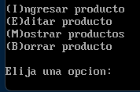

# MANUAL DE USUARIO 🕹️

## Introducción 📑
Con la finalidad de la implementación de las gramáticas, el curso arquitectura de computadores y ensambladores 1 se llevó a cabo un sistema para punto de venta, dicho programa control de ventas y clientes. Además, se tendrá un módulo de reportería que trabajará sobre los datos almacenados por el sistema y un módulo para carga masiva de datos.
___

 

                                                DESCRIPCION 📄

 

## *Acceso a aplicación*
    Al iniciar el programa, será necesario verificar la presencia del archivo de configuración, en el directorio desde donde se ejecutó el programa, cuyo nombre debe ser "PRA2.CNF". Si no se llegara a encontrar tal archivo se denegará el acceso y se cerrará automáticamente el programa. Si el archivo es encontrado, se procederá a analizar su contenido. El archivo deberá tener el siguiente formato:

 

## *Productos*
    Toda operación sobre productos deberá ser realizada sobre un archivo llamado “PROD.BIN”. Se deberá verificar su existencia, de lo contrario se creará automáticamente al momento de que se ingrese el primer producto. Toda operación sobre productos deberá ser realizada sobre un archivo llamado “PROD.BIN”. 

    Debe cumplir las siguientes condiciones:

| Descripción |           Validez        |
| ------  | ------ |
| Código      | caracteres válidos: [A-Z0-9] |
| Descripción | caracteres válidos: [A-Za-z0-9,.!] |  
| Precio      | número |
| Unidades    | número |  

 

* ## *Ingreso de productos*

- DOSBox
- MASM

# *Ejecución*
1. Abrir DOSBox
2. Compilar el archivo `prac.asm` con el comando `ml prac.asm`
3. Ejecutar el archivo `prac.exe` con el comando `prac.exe`

# *Inicio de la aplicación*

Se una pantalla con los datos del desarrollador y es posible acceder al menú principal presionando `Enter`.

# *Menú Principal*

En el menú principal se puede seleccionar entre las siguientes opciones:
- Productos
- Ventas
- Herramientas

## *Iniciar Juego*

Al seleccionar la opción `Menú productos` se inicia una nueva partida.
