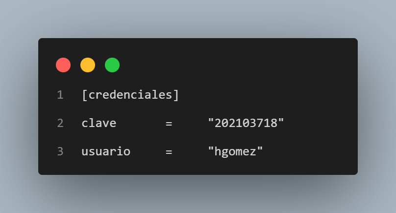
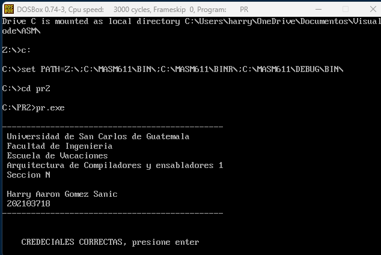
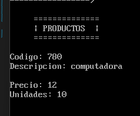
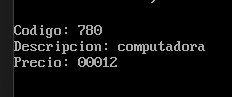
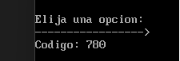
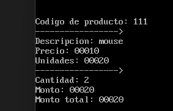

# MANUAL DE USUARIO 🕹️

 

## Introducción 📑
Con la finalidad de la implementación de las gramáticas, el curso arquitectura de computadores y ensambladores 1 se llevó a cabo un sistema para punto de venta, dicho programa control de ventas y clientes. Además, se tendrá un módulo de reportería que trabajará sobre los datos almacenados por el sistema y un módulo para carga masiva de datos.

___

 

## DESCRIPCION DEL SISTEMA 📄

 

## *Acceso al sistema:*
Al iniciar el programa, será necesario verificar la presencia del archivo de configuración, en el directorio desde donde se ejecutó el programa, cuyo nombre debe ser "PRA2.CNF". Si no se llegara a encontrar tal archivo se denegará el acceso y se cerrará automáticamente el programa. Si el archivo es encontrado, se procederá a analizar su contenido. El archivo deberá tener el siguiente formato:

 

## *Ejecución*
1. Abrir DOSBox
2. Compilar el archivo `main.asm` con el comando `ml main.asm`
3. Ejecutar el archivo `main.exe` con el comando `main.exe`

 

# *Inicio del sistema🪄*
Si las credenciales fueron correctas se iniciará una pantalla con los datos del desarrollador y es posible acceder al menú principal presionando `Enter`.

 

## *Menú Principal🏛️*
En el menú principal se puede seleccionar entre las siguientes opciones:
- Productos
- Ventas
- Herramientas

 

___

 

## *Menú Productos🏛️*
Toda operación sobre productos deberá ser realizada sobre un archivo llamado “PROD.BIN”. Se deberá verificar su existencia, de lo contrario se creará automáticamente al momento de que se ingrese el primer producto.

Debe cumplir las siguientes condiciones:

| Descripción |           Validez        |
| ------  | ------ |
| Código      | caracteres válidos: [A-Z0-9] |
| Descripción | caracteres válidos: [A-Za-z0-9,.!] |  
| Precio      | número |
| Unidades    | número |  

 

* ## *Ingreso de productos*
Para esta sección simplemente se le solicitarán ingresar los datos requeridos, se validarán según corresponda y se añadirá el producto en el archivo indicado. 

 

* ## *Mostrar productos*
El sistema cuenta con una opción para mostrar los productos ingresados. Estos productos serán mostrados en grupos de cinco. Una vez mostrados los primeros cinco productos, presione ’ENTER’ si desea continuar o ’q’, letra ’q’ minúscula, si desea terminar esta operación.

 

* ## *Borrar productos*
Para esta parte ingrese el código de un producto, se validará, y si corresponde al código de un producto en el archivo, este, será eliminado.

 

* ## *Opción regresar*
Esta opción hace regresar directamente hacia el menú principal por si se desea realizar otra operación

 

___

 

## *Menú Ventas🏛️*
El sistema contará con una sección en la que se podrá registrar una venta y generar el resumen correspondiente de la venta realizada.

- Cada venta podrá tener como máximo 10 ítems.

- Se solicitará código del producto y unidades a vender. Una vez ingresados se validarán las entradas y se
registrará el ítem. Este proceso se repetirá hasta completar los ítems o cuando el usuario escriba la palabra ’fin’, cuando se solicite el código.

- Se mostrará que el producto tenga existencias antes de agregar el ítem.

Toda venta realizada se deberá registrar en un archivo llamado “VENT.BIN”, el cuál se creará al insertar la primera venta si es que no existe. 

 

* ## *Ingresar venta*

 

* ## *Opción regresar*
Esta opción hace regresar directamente hacia el menú principal por si se desea realizar otra operación

 

___

 

## *Menú herramientas🏛️*
La sección de herramientas contiene una serie de utilidades cuya función principal será la generación de diversos reportes.

- *Generación de catálogo:* esta opción permitirá generar el listado completo de productos en formato HTML. Se mostraran todos los datos de cada producto. También, se mostrará la fecha y hora de generación del reporte. Al generar este reporte se visualizará en un archivo llamado “CATALG.HTM”.

- *Reporte alfabético de productos:* se muestra la cantidad de productos cuya descripción inicie con cada una de las letras del abecedario. El nombre del archivo generado es “ABC.HTM”.

- *Reporte de ventas:*
Este reporte tendrá tres secciones. En la primera se muestran las últimas cinco ventas. La siguiente se muestra la venta con el mayor monto y en la última sección se muestra la venta con menor monto. El nombre del archivo generado es “REP.TXT”.

- *Reporte de productos sin existencias:* muestra los productos que se hayan quedado sin existencias. Todos los datos del producto y la fecha y hora de generación. El archivo con el contenido de este reporte es “FALTA.HTM”.

 

___

 

~~~
Universidad de San Carlos de Guatemala 2023
Programador: Harry Aaron Gómez Sanic
Carné: 202103718
~~~