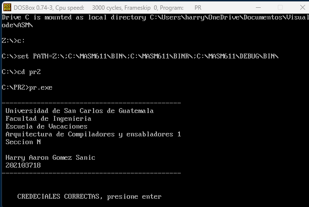
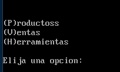
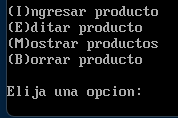

# *Requerimientos*
- DOSBox
- MASM

# *Ejecución*
1. Abrir DOSBox
2. Compilar el archivo `prac.asm` con el comando `ml prac.asm`
3. Ejecutar el archivo `prac.exe` con el comando `prac.exe`

# *Inicio de la aplicación*

Se una pantalla con los datos del desarrollador y es posible acceder al menú principal presionando `Enter`.

# *Menú Principal*

En el menú principal se puede seleccionar entre las siguientes opciones:
- Productos
- Ventas
- Herramientas

## *Iniciar Juego*

Al seleccionar la opción `Menú productos` se inicia una nueva partida.
